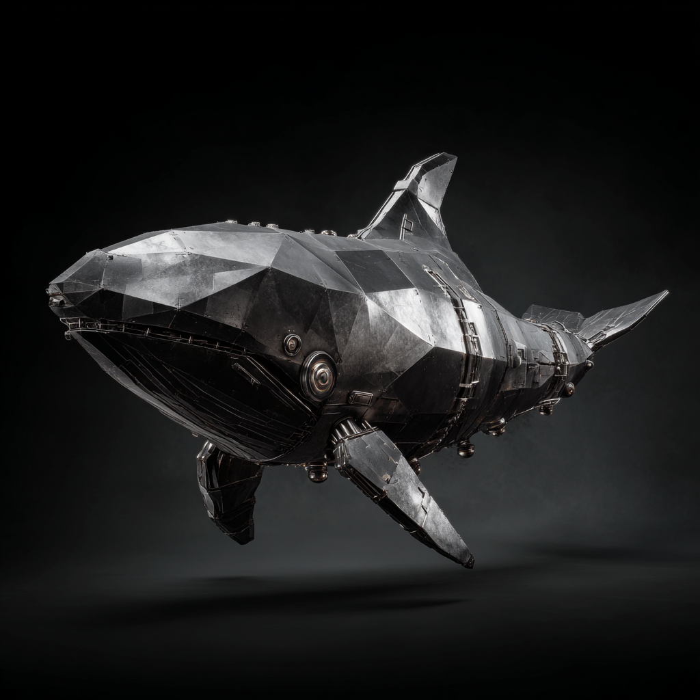

# 🐋 Iron Orca — Project Snapshot (v1.0, November 2025)

## Concept
Iron Orca is a modern reimagining of the Solaris-era **Orca** and **SE Toolkit**, designed to collect high-resolution host metrics locally, shape them into structured data, and feed them into a scalable backend for fleet-wide observability and analysis.

## Motivation
SNMP and polling-based systems miss short-lived anomalies and produce fragmented data. Iron Orca replaces that with a **push-based, context-rich model**, sampling its metrics using native OS tools on the host being monitored rather than polling that data at intervals from a remote monitoring system.

## Rationale

### The Modern Observability Framework

In today’s language, **observability** typically covers three “pillars”:
1. **Metrics** – numeric time-series (Prometheus, Datadog, M3, etc.)
2. **Logs** – text or structured events (Elastic, Loki, CloudWatch)
3. **Traces** – request path timing (Jaeger, Zipkin, OpenTelemetry)

DevOps teams often combine these into an end-to-end stack using **OpenTelemetry (OTel)** as the standard for collection and propagation.
- Cloud-native apps expose metrics via HTTP exporters.
- Infrastructure monitoring (Prometheus node_exporter, cAdvisor, etc.) gathers system data.
- Everything feeds centralized services that do alerting, visualization, and correlation.

This model works beautifully for *instrumented applications* and *homogeneous Kubernetes clusters.*
But it’s **overkill and underspecified** for classic systems operations.

---

### Where Iron Orca Fits

### 1. Between SNMP/Nagios and Cloud Observability
- SNMP/Nagios: lightweight, but too sparse and poll-bound.
- Prometheus/OTel: rich, but assumes app-level instrumentation and constant scraping.

**Iron Orca** gives ops a *middle path*:
- Host-centric, high-fidelity metrics (via `sar`)
- Structured JSON and time-series backend (M3DB)
- Optional event-driven integration with Nagios/PagerDuty

It’s *modern host observability* for environments that aren’t fully cloud-native.

#### 2. Complement to OpenTelemetry
OTel’s scope stops at the app boundary. It doesn’t know about kernel wait queues, IO saturation, or swap storms.
Iron Orca fills that blind spot: it describes **how the machine itself feels**, using metrics that OTel doesn’t provide.

#### 3. For the DevOps “Ops” Side
Cloud SRE tools focus on app latency and traces; DevOps engineers still need **bare-metal truth.**
Iron Orca gives them that truth in an accessible, scriptable form — not a vendor dashboard, not an ancient RRD view.

#### 4. Philosophical Niche
- Prometheus says: *“Poll everyone constantly.”*
- Datadog says: *“Ship everything to us.”*
- Adrian Cockcroft says: *“Let nodes tell you how they feel.”*
- **Iron Orca says:** *“Do just enough of all three.”*

---

### Summary
Iron Orca occupies a missing tier in today’s observability ecosystem —
**lightweight, node-aware, and self-reporting infrastructure observability** for hybrid or traditional ops environments.
It bridges old-school system monitoring and modern cloud telemetry with a pragmatic, open-source approach.

---

## Core Architecture

### Sardine (Agent)
A lightweight intermediary using `sar` (sysstat) as its data source.
- Emits **JSON-formatted vitals** based on the **USE Method** (Utilization, Saturation, Errors).
- Handles batching, tagging, and backpressure.
- Optionally reports local health state (OK/WARN/CRIT).

### Iron Orca Backend
- Ingests Sardine’s structured vitals into **M3DB**, Uber’s open-source, horizontally scalable time-series store.
- Provides a unified “fleet memory” instead of thousands of isolated RRDs.
- Offers **CLI**, **API**, and **Web UI** interfaces for querying and visualization.
- Integrates with **Jupyter** or **R** for exploratory analysis.

### Nagios Integration (Optional)
- Sardine can emit passive checks with CRIT/WARN/OK and diagnostic text.
- Leverages Nagios’s mature **PagerDuty** and **notification** pipeline.
- PNP4Nagios remains usable for quick trending graphs.

### RRD Compatibility and Migration
- Optional RRD-style perfdata output.
- Planned importer to consolidate legacy `.rrd` files into M3DB for unified analysis.

---

## Phased Plan (Summary)

1. **Phase 1:** Proof of concept — Sardine + `sar` + M3 + simple CLI/API.  
2. **Phase 2:** Fleet view, comparison, and web UI.  
3. **Phase 3:** Node-level health logic and Nagios passive alerts.  
4. **Phase 4:** RRD compatibility + migration of historical data.  
5. **Phase 5:** Optional local buffers, plugins for “pet” systems, and self-aware logic.

---

## Philosophy
Give every node just enough self-awareness to describe its health, collect only the most meaningful vitals, and centralize that knowledge in one powerful, open-source system.  
Iron Orca aims to be **industrial yet humane** — technical depth balanced with operational pragmatism.

**Mascot:** 🐋 *Keiko* — the “Iron Orca,” symbolizing freedom, intelligence, and industrial grace.

